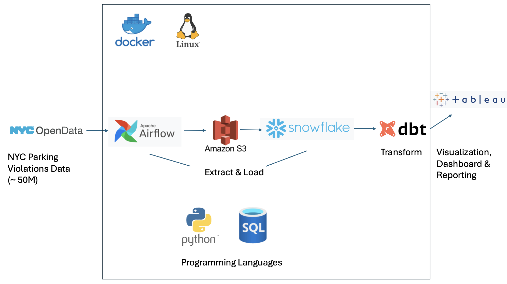

# ETLPipeline-ParkingViolations-SnowFlake

## Overview
This project focuses on building a **scalable ETL pipeline** for analyzing **NYC parking violations** data, which consists of approximately **50 million records**. The pipeline automates data ingestion, storage, transformation, and visualization using modern **data engineering tools and cloud technologies**.

## Key Features
- **Automated Data Ingestion** using Apache Airflow to extract data from NYC OpenData.
- **Cloud Storage** via Amazon S3 to store raw data before transformation.
- **Data Warehousing** using Snowflake for structured storage and analytics.
- **Data Transformation** with dbt (Data Build Tool) for refining raw data.
- **Visualization & Reporting** with Tableau for insightful dashboards.
- **Containerized Environment** using Docker for seamless development and deployment.

---

## Tech Stack & Tools
| Component                | Tool/Technology  |
|--------------------------|-----------------|
| **Orchestration**        | Apache Airflow  |
| **Storage**              | Amazon S3       |
| **Data Warehousing**     | Snowflake       |
| **Transformation**       | dbt             |
| **Programming Languages**| Python, SQL     |
| **Visualization**        | Tableau         |
| **Containerization**     | Docker          |


---

## Project Architecture
The ETL pipeline follows this structured workflow:
1. **Data Ingestion**: Airflow automates fetching NYC Parking Violations data.
2. **Storage**: Extracted data is staged in Amazon S3.
3. **Data Warehousing**: Data is loaded from S3 into Snowflake.
4. **Transformation**: dbt transforms and structures the data in Snowflake.
5. **Visualization**: Tableau generates reports and dashboards.

### Architecture Diagram


---

## Project Setup
### 1. Clone the Repository
```bash
git clone https://github.com/Vishruth008/ETLPipeline-ParkingViolations-SnowFlake.git
cd ETLPipeline-ParkingViolations-SnowFlake
```

### 2. Build & Start Docker Containers
```bash
docker-compose up --build -d
```

### 3. Access the Airflow UI
Once the containers are running, open **Airflow UI** in your browser to monitor and trigger DAGs:
```
http://localhost:8080
```

---

## Usage Guide
1. **Trigger** the Airflow DAG to start data ingestion.
2. **Monitor** the extraction & loading process into Amazon S3.
3. **Check** data transformation in Snowflake using dbt.
4. **Generate Reports** in Tableau for insights from structured data.

---

## Contributors
- **Shaun Kirthan** - [GitHub](https://github.com/shaunkirthan)

